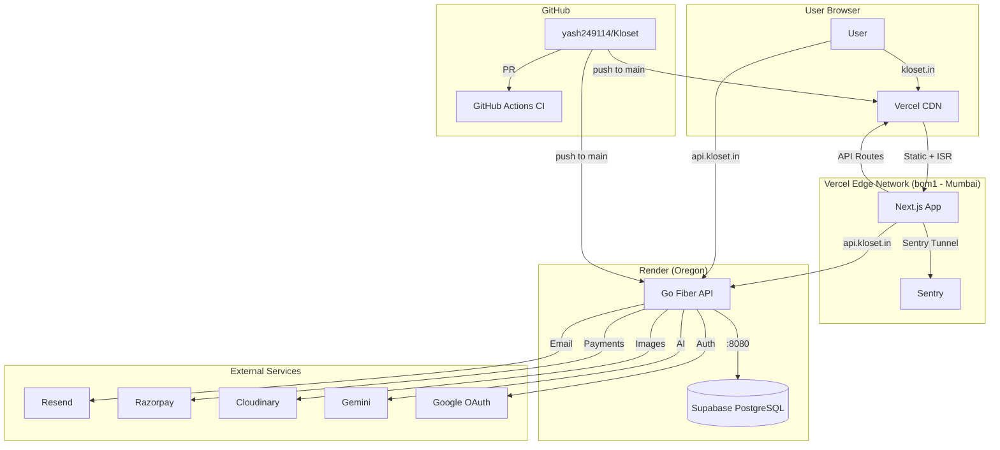
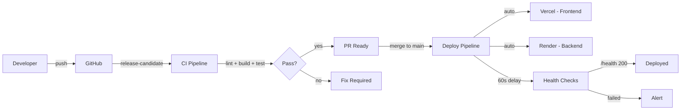

# DEPLOYMENT READINESS REPORT

**Date:** 2026-06-16
**Branch:** `release-candidate`
**Status:** READY FOR DEPLOYMENT (with manual DNS + env var setup required)

---

## Build Verification

| Component | Command | Result |
|-----------|---------|--------|
| Frontend | `npm run build` (in `Kloset/frontend/`) | **PASS** — 56/56 pages generated |
| Backend | `go build ./...` (in `Kloset/backend/`) | **PASS** — compiles cleanly |

### Build Warnings (non-blocking)

| Warning | Source | Action |
|---------|--------|--------|
| `disableLogger` deprecated | Sentry SDK | Migrate to `webpack.treeshake.removeDebugLogging` |
| `automaticVercelMonitors` deprecated | Sentry SDK | Migrate to `webpack.automaticVercelMonitors` |
| `middleware` convention deprecated | Next.js 16 | Migrate to `proxy` convention |
| `NEXT_PUBLIC_GOOGLE_CLIENT_ID` not set | `.env.local` missing | Expected — set in Vercel Dashboard |

---

## Deployment Architecture

### CI/CD Flow

---

## Files Created / Modified

| File | Status | Purpose |
|------|--------|---------|
| `render.yaml` | **NEW** | Render infrastructure-as-code for backend |
| `.vercelignore` | **NEW** | Exclude backend, docs, tests from Vercel build |
| `DEPLOYMENT_READINESS_REPORT.md` | **NEW** | This report |

---

## Environment Variables Checklist

### Frontend (Vercel Dashboard)

| Variable | Required | Where to Get |
|----------|----------|--------------|
| `NEXT_PUBLIC_API_URL` | YES | `https://api.kloset.in/api/v1` (set after Render deploy) |
| `NEXT_PUBLIC_CLOUDINARY_CLOUD_NAME` | YES | Cloudinary Dashboard > Settings |
| `NEXT_PUBLIC_CLOUDINARY_UPLOAD_PRESET` | YES | Cloudinary > Upload > Upload presets |
| `NEXT_PUBLIC_RAZORPAY_KEY_ID` | YES | Razorpay Dashboard > API Keys (use `rzp_live_`) |
| `NEXT_PUBLIC_GOOGLE_CLIENT_ID` | YES | Google Cloud Console > Credentials |
| `NEXT_PUBLIC_SENTRY_DSN` | NO | Sentry.io > Project Settings |
| `NEXT_PUBLIC_POSTHOG_KEY` | NO | PostHog Dashboard > Project Settings |
| `VERCEL_ENV` | AUTO | Set automatically by Vercel |

### Backend (Render Dashboard)

| Variable | Required | Where to Get |
|----------|----------|--------------|
| `APP_URL` | YES | `https://api.kloset.in` |
| `FRONTEND_URL` | YES | `https://kloset.in` |
| `ALLOWED_ORIGINS` | YES | `https://kloset.in` |
| `DB_HOST` | YES | Supabase > Settings > Database > Host |
| `DB_PORT` | YES | `6543` (Supabase pooler) |
| `DB_USER` | YES | Supabase > Settings > Database > User |
| `DB_PASSWORD` | YES | Supabase > Settings > Database > Password |
| `DB_NAME` | YES | `postgres` |
| `JWT_SECRET` | YES | Generate: `openssl rand -base64 48` |
| `CLOUDINARY_CLOUD_NAME` | YES | Cloudinary Dashboard |
| `CLOUDINARY_API_KEY` | YES | Cloudinary Dashboard |
| `CLOUDINARY_API_SECRET` | YES | Cloudinary Dashboard |
| `RAZORPAY_KEY_ID` | YES | Razorpay Dashboard (use `rzp_live_`) |
| `RAZORPAY_KEY_SECRET` | YES | Razorpay Dashboard |
| `RAZORPAY_WEBHOOK_SECRET` | YES | Razorpay > Webhooks |
| `RESEND_API_KEY` | YES | Resend Dashboard |
| `GEMINI_API_KEY` | YES | Google AI Studio |
| `GOOGLE_CLIENT_ID` | YES | Google Cloud Console |
| `SENTRY_DSN` | NO | Sentry.io |

---

## DNS Configuration Required

### kloset.in (Frontend to Vercel)

| Type | Name | Value |
|------|------|-------|
| CNAME | `@` | `cname.vercel-dns.com` |
| CNAME | `www` | `cname.vercel-dns.com` |

### api.kloset.in (Backend to Render)

| Type | Name | Value |
|------|------|-------|
| CNAME | `api` | `kloset-api.onrender.com` |

---

## Post-Deploy Verification Checklist

- [ ] DNS records updated for `kloset.in` and `api.kloset.in`
- [ ] Vercel environment variables set (all `NEXT_PUBLIC_*`)
- [ ] Render environment variables set (all backend vars)
- [ ] `https://kloset.in` returns Next.js app (not GoDaddy page)
- [ ] `https://api.kloset.in/health` returns 200
- [ ] `https://kloset.in/auth/login` loads login page
- [ ] `https://kloset.in/discover` shows outfit grid
- [ ] `https://kloset.in/seller` loads seller dashboard
- [ ] `https://kloset.in/admin` loads admin dashboard
- [ ] Google OAuth flow works end-to-end
- [ ] Image upload works (Cloudinary)
- [ ] Razorpay payment flow works
- [ ] Email verification works (Resend)
- [ ] Sentry error tracking receives test error
- [ ] PostHog analytics events fire

---

## Rollback Plan

If deployment fails:

1. **Frontend:** Vercel auto-rollback to previous deployment (Dashboard > Deployments > Promote)
2. **Backend:** Render auto-rollback on health check failure, or manual rollback in Dashboard
3. **DNS:** Revert CNAME records to previous values
4. **Database:** Supabase point-in-time recovery if data corruption

---

## Risk Assessment

| Risk | Severity | Mitigation |
|------|----------|------------|
| DNS not updated | P0 | Domain owner must update records |
| Missing env vars | P0 | Follow checklist above |
| Supabase connection limits | P1 | Use connection pooler (port 6543) |
| Sentry deprecation warnings | P2 | Migrate in next sprint |
| No `render.yaml` (was missing) | P1 | **FIXED** — created in this commit |
| No `.vercelignore` (was missing) | P1 | **FIXED** — created in this commit |
| GoDaddy page served at kloset.in | P0 | DNS points to GoDaddy, not Vercel |
